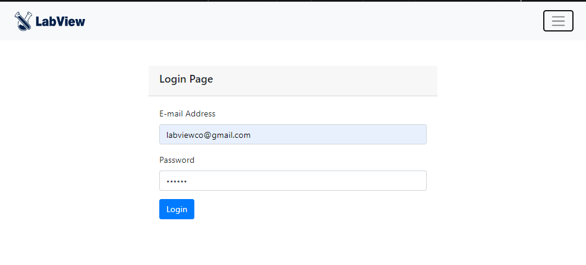

This is my graduation project. 
LabView is a QR-Based Inventory Management System.
Developed with php and Bootstrap framework, and MySQL for database.
It has registration, email verification, login. Three dashboards for three roles which are administrator, staff and user.
User can browse inventory, search for an item and place an order. 
Administrator or staff can deny or approve the order.
Administrator has user management capabilities. Inventory management capabilities.
 Staff also have inventory management capabilities.

